# HypeJuice

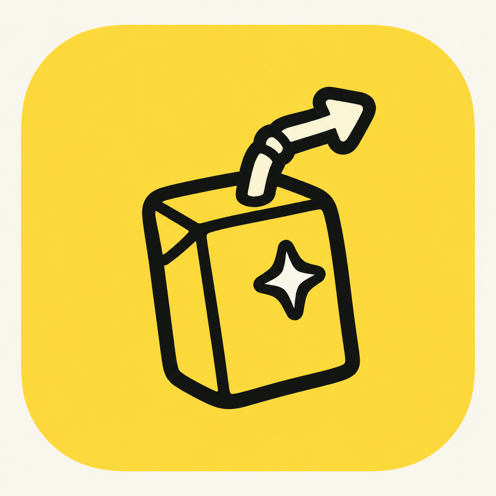

**RevenueCat Shipaton 2026 submission · NextGen Award Category**

<sub>Built by Harpita Pandian (Rutgers University, New Brunswick) and Harpith Pandian (Rutgers University, New Brunswick)</sub>

[Devpost project page](https://devpost.com/software/hypejuice) · [Watch the demo video](https://youtu.be/p0Mi1I1xhyo?si=84QuKBfBZZfQOGGj)

### You built the app. Now let's make some noise.

As builders, we know the excitement of bringing an app to life. Then comes the big question: **How do I get my first users?** Getting people to discover and actually use your app is the hard part. UGC style videos can catch on, spark curiosity, and bring in new users, but creating them shouldn't become a full time job.

HypeJuice learns your app inside out and turns its best features into fun AI UGC style videos made for your audience. Explore fresh ideas, discover your content taste, and create videos that make people stop, watch, and want in, while you keep building. Built for solo developers, solopreneurs, student builders, and anyone who's made a great app and dreams of getting millions of eyes on it.

## App preview

<table>
  <tr>
    <td align="center"><a href="assets/screenshots/01-welcome.png">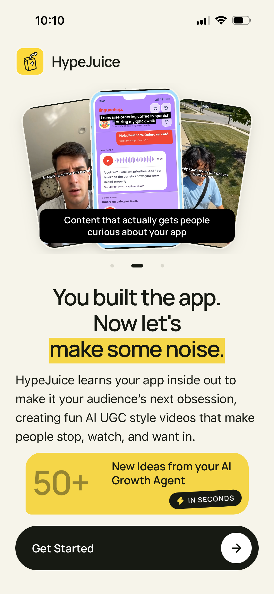</a></td>
    <td align="center"><a href="assets/screenshots/02-pro-plan.png">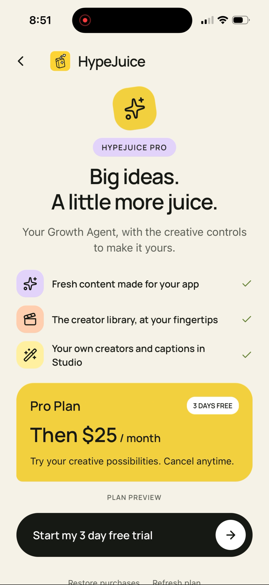</a></td>
    <td align="center"><a href="assets/screenshots/03-app-brief.png">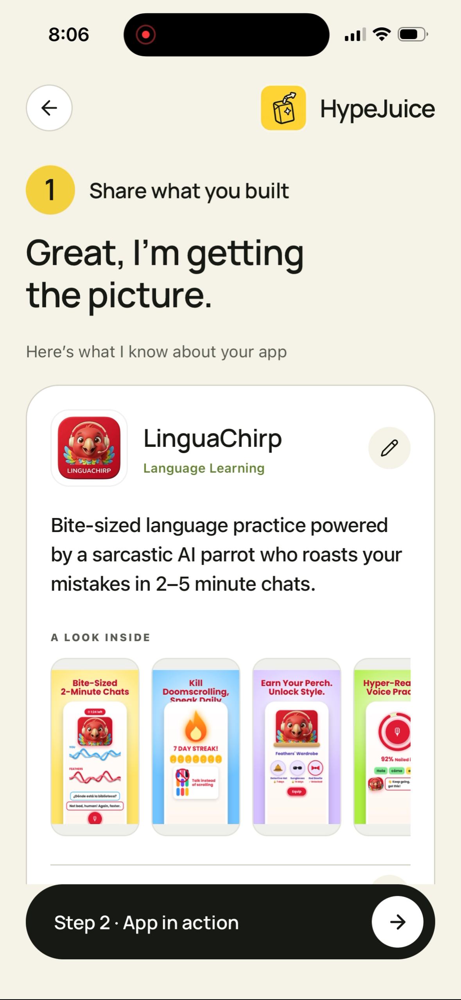</a></td>
    <td align="center"><a href="assets/screenshots/04-app-demos.png">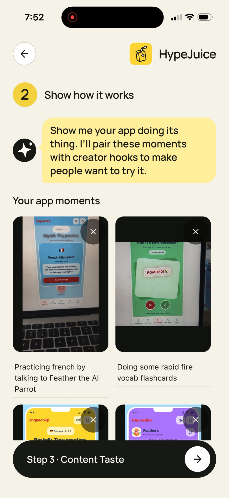</a></td>
    <td align="center"><a href="assets/screenshots/05-content-taste.png">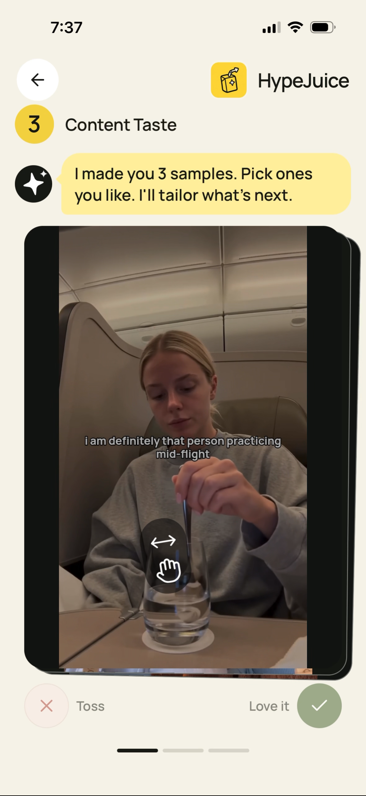</a></td>
    <td align="center"><a href="assets/screenshots/06-taste-feedback.png">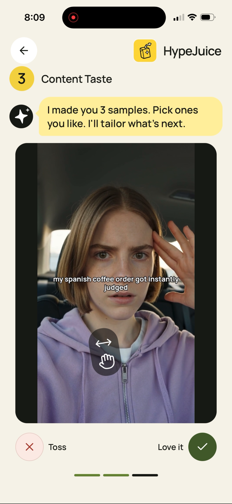</a></td>
    <td align="center"><a href="assets/screenshots/07-discover.png">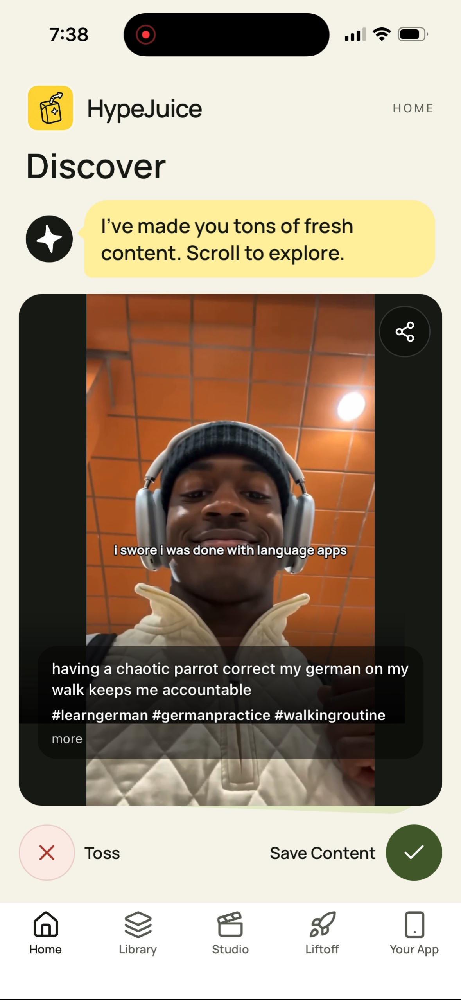</a></td>
    <td align="center"><a href="assets/screenshots/08-library.png">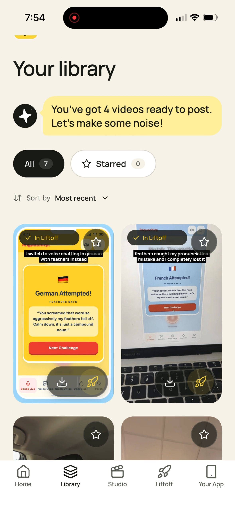</a></td>
    <td align="center"><a href="assets/screenshots/09-creator-library.png">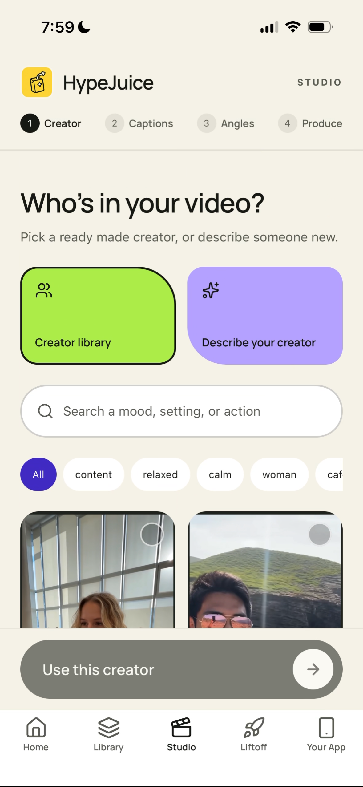</a></td>
    <td align="center"><a href="assets/screenshots/10-creative-angles.png">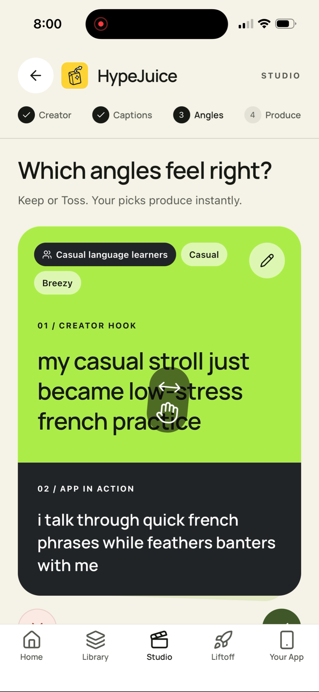</a></td>
    <td align="center"><a href="assets/screenshots/11-studio-result.png">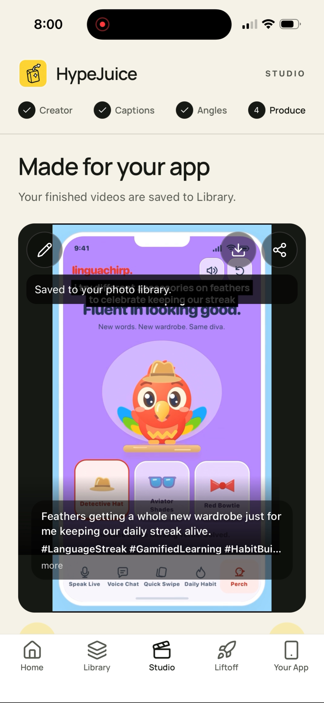</a></td>
    <td align="center"><a href="assets/screenshots/12-liftoff.png">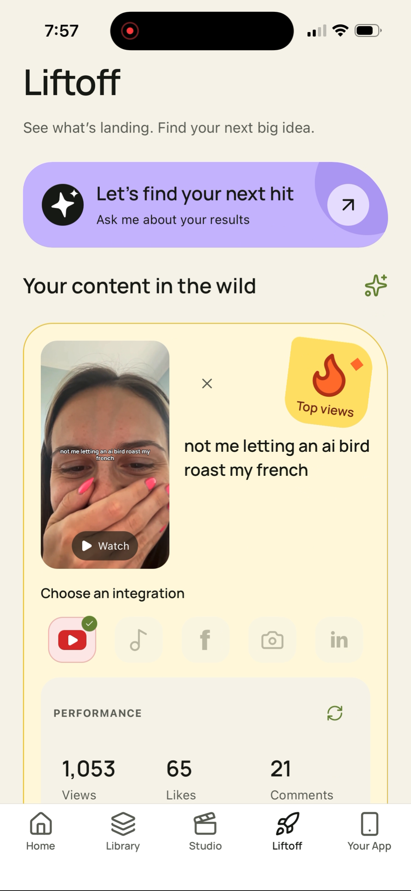</a></td>
  </tr>
</table>

**HypeJuice is a mobile app built with Expo and React Native for iOS and Android, with web support.**

## Tools & tech stack

| Layer | Technology |
| --- | --- |
| Mobile and web | Expo, React Native, Expo Router, TypeScript |
| Agent | Google Gemini for app understanding, creative angles, captions, and performance chat |
| Video | Reusable creator library, optional ByteDance Seedance 2.0 generation via Higgsfield, FFmpeg assembly and text overlays |
| Backend and storage | Hono on Node.js, Supabase Auth, Postgres, and private Storage |
| Subscriptions | RevenueCat SDK, Test Store, and server subscription verification |
| Post metrics | YouTube Data API for connecting public videos and tracking performance. More platform integrations coming soon. |

## RevenueCat integration

HypeJuice is submitted in the **Next Gen Award** category as an app in development. It has not yet been published to the App Store or Google Play and is not yet monetized.

The RevenueCat React Native SDK is integrated for Pro subscriptions, purchases, restores, and server-verified access. For this submission, testing uses **RevenueCat Test Store's sandbox**, with a configured Pro offer of a 3 day free trial followed by $25 USD per month. This is a test configuration, not a live subscription available for purchase.

A successful trial start was recorded in the RevenueCat sandbox customer dashboard. **No real payment was taken and no subscription revenue was generated.** This demonstrates the Test Store trial flow, not live App Store or Google Play billing.

## Instructions for running app from source

HypeJuice can be run from this repository without a published App Store or Google Play release. The instructions below use a local backend and RevenueCat Test Store. The creator library is already hosted and connected for testing. You still need your own service credentials.

### 1. Install and prepare

Install Node.js 22.13+ on the Node 22 line (see `.nvmrc`), or 24.3+, plus FFmpeg and ffprobe. Then:

```sh
git clone https://github.com/Harpita-P/HypeJuice.git
cd HypeJuice
npm ci
cp -n .env.example .env
```

If already cloned, run the last two commands from the project root. The copy command preserves an existing `.env`.

### 2. Select local evaluation mode

Set these values in your local `.env`. This avoids account sign-up for the local walkthrough while still verifying the test subscription:

```ini
AUTH_MODE=local
EXPO_PUBLIC_AUTH_MODE=local
STUDIO_ALLOW_UNAUTHENTICATED=true
EXPO_PUBLIC_API_URL=http://127.0.0.1:8787
REVENUECAT_ENFORCE_ENTITLEMENTS=true
REVENUECAT_ALLOW_SANDBOX=true
```

Use this mode only on your computer or a trusted private network, never on a public server or tunnel. Keep server credentials out of `EXPO_PUBLIC_` variables and do not commit `.env`.

### 3. Connect the required services

See the [configuration guide](docs/IMPLEMENTATION_SUMMARY.md#configuration-and-local-development) for the required services and how to connect them through your `.env` file. Follow the [Test Store setup](docs/IMPLEMENTATION_SUMMARY.md#test-store-configuration) to configure subscription testing.

### 4. Start both processes

Keep the backend running in one terminal:

```sh
npm run api
```

In a second terminal, choose one way to open the app:

* **Browser on the same computer:** run `npm run web` and open the address Expo prints. Keep `EXPO_PUBLIC_API_URL=http://127.0.0.1:8787`.
* **iPhone or Android:** use Expo Go compatible with this project's Expo SDK 57. Connect the phone and computer to the same Wi-Fi, change `EXPO_PUBLIC_API_URL` to `http://YOUR_COMPUTER_LAN_IP:8787`, then run `npm start` and open its QR code with Expo Go. Replace the placeholder with your computer's actual LAN IP, not `localhost`.

Restart both processes after changing `.env`. To check backend connectivity, open the configured API address followed by `/health`; this confirms the server is reachable, not that every provider is configured.

[MIT license](LICENSE)

Coming soon to the App Store and Google Play.
